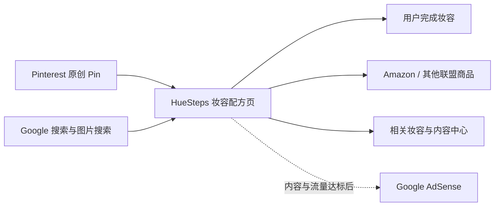

# HueSteps 产品需求文档（PRD）

> **品牌**：HueSteps  
> **域名**：`https://huesteps.com`  
> **品牌主张**：Makeup, step by step.  
> **目标市场**：美国，英文内容优先  
> **产品形态**：妆容教程内容站 + Pinterest 获客 + 联盟商品推荐 + 后置展示广告  
> **部署平台**：Cloudflare Pages  
> **版本**：v1.1  
> **状态**：产品与 UI/UX 方案已完成 / 可进入设计系统与页面开发  
> **更新日期**：2026-07-10

---

## 1. 执行摘要

HueSteps 是一个面向美国用户的独立妆容教育与导购品牌。它把“看起来好看但难以复刻”的妆容灵感，转换成用户真正能照着完成的 **makeup recipes（妆容配方）**：说明适合场景、所需时间、难度、颜色与产品角色、具体上妆位置、6–10 个步骤，并针对眼型、肤色和底调提供调整方案。

产品的核心价值不是提供更多漂亮妆容图，而是降低用户从“看到妆容”到“完成妆容”的执行成本。

首发采用纯静态内容站，部署在 Cloudflare Pages。MVP 不使用付费 SaaS、运行时 AI、数据库、用户系统、评论系统或付费图片服务；不在内容尚未形成价值前接入 AdSense。除已经购买的域名、人工与可选的离线内容制作成本外，基础设施月成本必须保持 **0 美元**。

### 1.1 核心产品定位

**英文定位**：

> Wearable makeup recipes for real-life occasions—step by step, adapted by eye shape and skin tone.

**中文解释**：

> 为美国用户提供真实可复刻的场景妆容配方，并根据眼型、肤色与底调给出调整方式，同时提供平价、中档和高端三档商品选择。

### 1.2 核心商业路径



### 1.3 已确定的硬约束

1. HueSteps 是独立品牌，不是 AI Beauty Stylist 的子站或换壳站。
2. 使用新的 Pinterest Business Account，并只认领 `huesteps.com`。
3. 不复用 AI Beauty Stylist 的图片、Pin、文案、品牌元素、分析 ID、受众数据或账号互动。
4. 目标用户和页面语言均以美国市场、英文内容为准。
5. 首发内容必须让用户在不点击任何商品链接的情况下也能完成妆容。
6. Amazon、AdSense 和其他联盟是内容价值之后的变现层，不是页面存在的理由。
7. 冷启动基础设施月成本为 0 美元；任何付费升级必须由已有收入或明确容量需求触发。
8. UI/UX 采用“Color Atelier + Beauty Editorial”的统一设计方向；React Bits 只作为按需微交互层，不成为全站 UI 框架。

---

## 2. 背景与机会

Pinterest 上存在大量妆容灵感图，但常见问题是：

- 只有最终效果，没有可执行步骤；
- 步骤过于通用，没有说明颜色放在哪里；
- 不说明不同眼型、肤色或底调如何调整；
- 商品链接与妆容缺乏对应关系；
- 页面以广告和联盟按钮为中心，用户仍需返回搜索引擎寻找答案；
- AI 图片可能呈现无法实际完成的妆效，却被包装成真实使用效果。

HueSteps 的机会是建立一个结构稳定、视觉清晰、可以执行的妆容配方库，让每一个页面同时具备：

1. Pinterest 可传播的视觉结果；
2. 用户可照做的完整步骤；
3. 针对个人特征的调整信息；
4. 自然产生的商品选择需求；
5. Google 搜索和图片搜索所需要的独立信息增量。

---

## 3. 产品目标与非目标

### 3.1 0–90 天目标

- 建立 HueSteps 独立品牌、网站、内容结构和 Pinterest 账号。
- 上线 4 个内容中心与 24 篇完整妆容配方。
- 每篇内容制作 2–3 张实质不同的原创 Pin，共 48–72 张。
- 建立可重复的选题、制作、审核、发布和更新流程。
- 让全部可索引页面具备稳定 canonical、可抓取 HTML、站内链接和结构化数据。
- 在不接入 AdSense 的情况下验证 Pinterest 出站点击、美国用户占比、教程阅读与商品点击意图。
- 网站基础设施账单保持 0 美元。

### 3.2 90–180 天目标

- 根据 Pinterest 保存、出站点击和 GSC 查询数据扩展有效内容主题。
- 通过 Amazon Associates 的站点审核与有效销售要求。
- 内容达到 30–40 篇并满足质量、流量、信任与隐私门槛后，再申请 AdSense。
- 基于真实点击与订单数据决定是否申请 Sephora、Ulta 或品牌联盟计划。
- 逐步形成 Pinterest 之外的 Google 图片搜索与普通搜索流量。

### 3.3 非目标

MVP 明确不做：

- 护肤、发型、美甲、香水等泛美妆扩张；
- 用户注册、收藏、评论、社区或投稿；
- 在线虚拟试妆、摄像头、图片上传或个性化 AI；
- 运行时调用生成式 AI API；
- 电商结账、库存、订单或自营商品；
- 批量生成城市、年龄、品牌、色号等近重复 SEO 页面；
- 独立的“Best Products”排行榜，除非有清晰方法、证据与独立编辑价值；
- 首屏广告、弹窗广告或以广告填满页面；
- 付费 CMS、付费分析、Cloudflare Images、Stream 或其他付费基础设施。

---

## 4. 目标用户与核心任务

### 4.1 主要用户

**人群 A：场景驱动的普通化妆用户**

- 25–44 岁美国女性为主要受众，45 岁以上用户为次要扩展受众；
- 会在 Pinterest 搜索婚礼宾客、约会、通勤、聚会、假日等妆容；
- 需要明确、可操作的步骤，而不是专业彩妆师术语；
- 愿意购买推荐产品，但会比较价格档位。

**人群 B：需要适配建议的用户**

- 关注 hooded eyes、monolids、downturned eyes 等眼型差异；
- 关注 fair、olive、medium、deep skin 及 warm、cool、neutral undertone；
- 担心同一套颜色和位置在自己脸上不成立。

**人群 C：带购物意图的教程用户**

- 已经决定复刻某个妆容；
- 希望快速知道需要哪些“产品角色”，例如哑光过渡色、细闪主色、棕色眼线；
- 需要 Budget、Mid-range、Luxury 三档可替换选择。

### 4.2 Jobs To Be Done

1. 当我看到一个喜欢的妆容时，我想快速判断它是否适合我的场景、时间和能力。
2. 当我准备复刻妆容时，我想知道每一步用什么颜色、放在哪里、做到什么程度。
3. 当我的眼型或肤色与示例不同，我想知道应该怎么改，而不是照搬后失败。
4. 当我缺少产品时，我想按预算找到能完成相同功能的选择。
5. 当结果不理想时，我想知道最常见的失败原因以及如何修正。

---

## 5. 产品原则

1. **先完成任务，再谈购物**：用户不购买任何产品也应能完成教程。
2. **配方，不是灵感堆积**：每页都必须包含产品角色、位置、步骤和调整方法。
3. **适配比模板更重要**：眼型、肤色和底调建议必须对当前妆容有实际差异。
4. **证据边界清晰**：未真人测试就不声称“亲测”“持妆多久”或“Products used”。
5. **内容先于变现**：广告和联盟组件不得阻断步骤阅读。
6. **静态优先**：没有明确用户价值的 JavaScript、数据库和第三方脚本不上线。
7. **少而强**：宁可发布 24 篇完整页面，也不发布 200 篇换关键词的模板页。
8. **移动端优先**：Pinterest 用户大多在移动设备完成从 Pin 到教程的路径。

---

## 6. 信息架构与 URL 规范

### 6.1 主导航

- Home
- Occasion Makeup
- Eye Shape Makeup
- Skin Tone & Undertone
- Everyday Makeup
- About

### 6.2 页脚与信任页面

- About HueSteps
- Editorial Policy
- AI Image & Content Policy
- Affiliate Disclosure
- Privacy Policy
- Terms of Use
- Contact & Corrections

### 6.3 页面类型

| 页面类型 | 主要任务 | 是否进入 sitemap | MVP 数量 |
|---|---|---:|---:|
| 首页 | 解释价值、分流到 4 个用户任务 | 是 | 1 |
| 内容中心页 | 组织场景/适配路径，不只是文章列表 | 是 | 4 |
| 妆容配方页 | 让用户完成一套妆容 | 是 | 24 |
| 关于/编辑政策/披露 | 建立信任和说明边界 | 是 | 4–6 |
| 隐私/条款 | 合规说明 | 是 | 2 |
| 标签、筛选、预览页 | 辅助浏览或内部验证 | 否，默认 noindex | 按需 |

### 6.4 URL 规则

- 首页：`/`
- 内容中心：`/occasion-makeup/`、`/eye-shape-makeup/`、`/skin-tone-undertone/`、`/everyday-makeup/`
- 配方页：`/{hub}/{descriptive-slug}/`
- 信任页：`/about/`、`/editorial-policy/`、`/affiliate-disclosure/` 等
- URL 全部小写、使用连字符，不包含日期、参数或无意义 ID。
- 带 UTM 的访问统一 canonical 到无参数版本。
- 生产环境唯一 canonical host 为 `https://huesteps.com`；`www` 和 HTTP 只做单跳 301。

---

## 7. 核心用户流程

### 7.1 Pinterest → 完成妆容 → 商品点击

1. 用户在 Pinterest 看到最终妆效或步骤型 Pin。
2. Pin 直接进入与画面一致的配方页，不进入首页或泛分类页。
3. 首屏展示最终效果、适用场景、时间、难度和明确的 “Start the steps” 锚点。
4. 用户查看产品角色和完整步骤。
5. 用户根据眼型、肤色或底调调整。
6. 用户按需选择 Budget、Mid-range 或 Luxury 商品。
7. 页面底部进入相邻场景或相似妆效，形成第二次内容消费。

### 7.2 Google → 直接解决问题

1. 用户搜索具体场景、眼型或妆效。
2. 页面标题、H1 和首段直接回答当前意图。
3. 用户在无需横向跳转的情况下获得完整步骤和适配说明。
4. 页面通过相关内容继续引导，而不是堆叠无关商品。

### 7.3 内容编辑 → 发布

1. 编辑从已批准的内容 brief 开始，不从关键词批量生成开始。
2. 按结构化内容模型填写配方、步骤、适配、错误修正、图片和商品角色。
3. 自动校验必填字段、图片尺寸、内部链接、canonical、结构化数据和禁止措辞。
4. 人工审核妆容可实现性、图片与步骤一致性、披露和移动端预览。
5. 合并到主分支后由 Cloudflare Pages 自动构建并部署。

---

## 8. 页面需求

### 8.1 首页

首页必须在首屏回答：HueSteps 是什么、适合谁、用户下一步可以做什么。

必需模块：

1. 品牌价值主张与一句具体说明；
2. 4 个任务入口，而非仅展示最新文章；
3. 6–8 个精选妆容配方；
4. “Choose by eye shape / skin tone / occasion” 浏览路径；
5. 编辑原则与 AI 内容边界的简短说明；
6. 最新更新或季节性内容，不使用虚假“刚更新”日期；
7. About、Editorial Policy 和 Affiliate Disclosure 的信任入口。

### 8.2 内容中心页

内容中心不是标签列表，必须包含：

- 当前主题如何选择的简短指南；
- 子任务或决策入口；
- 精选配方卡片；
- 对眼型/肤色/场景差异的解释；
- 与其他内容中心的自然交叉路径；
- 至少一个具有信息增量的矩阵、清单或决策提示。

### 8.3 妆容配方页

每个配方页必须依序包含：

1. **Hero**：最终妆容图、H1、直接说明、更新时间；
2. **Quick facts**：场景、完成时间、难度、妆效、适合对象；
3. **AI 披露**：若图片由 AI 生成，首图附近显示 `AI-generated makeup visualization`；
4. **The look recipe**：色彩、质地与产品角色清单；
5. **Before you start**：工具、皮肤/眼部准备与可替代项；
6. **6–10 个明确步骤**：每步包含动作、位置、用量/强度和完成标准；
7. **Placement guide**：眼影、腮红、高光等位置示意或分区图；
8. **Make it work for you**：至少覆盖相关眼型、肤色或底调调整；
9. **Common mistakes & fixes**：至少 3 个当前妆容特有的问题；
10. **Suggested products**：Budget、Mid-range、Luxury 三档；
11. **联盟披露**：在首个联盟链接之前清楚展示；
12. **Related recipes**：3–6 个与用户下一任务相关的页面。

### 8.4 商品推荐卡

每张卡必须显示：

- 产品角色，而不只是品牌和商品名；
- 推荐理由及适用范围；
- 预算档位；
- 商家名称；
- 最近一次链接核验日期；
- 明确的外部购物 CTA。

约束：

- AI 妆容页使用 `Suggested products to recreate this look`，不得使用 `Products used in this look`。
- 不展示无法自动保持准确的价格、折扣、评分或库存。
- 不复制 Amazon 或品牌商家的产品描述。
- 商品图只使用自有授权素材或联盟计划明确允许的官方方式。
- 所有付费关系链接使用 `rel="sponsored nofollow"`。
- 页面不得把普通商品推荐伪装成独立真人评测。

---

## 9. UI/UX 设计系统与 React Bits 应用规范

### 9.1 本地技能库的 UI/UX 能力分工

本项目使用以下技能组合，但每项技能承担不同职责，避免多个设计体系互相冲突：

| 技能 | 在 HueSteps 中的职责 | 使用边界 |
|---|---|---|
| `design-taste-frontend` | 读取品牌与受众、确定设计方向、控制视觉变化度、避免模板化和常见 AI 设计痕迹 | 作为视觉总原则和最终 pre-flight 标准 |
| `ui-ux-pro-max` | 提供颜色、字体、响应式、触控、动效、无障碍和交互状态规则 | 用于设计令牌与量化 UX 验收，不机械采用其通用行业模板 |
| `content-project-audit` | 从用户、Google、产品经理和 SEO 四个视角验证页面是否值得存在 | 决定信息架构、首屏任务、内容增量和索引门槛 |
| `imagegen` | 生成 Hero、妆效、位置示意和 Pin 所需的项目专属视觉素材 | 图片必须通过真实性、授权、披露和构建时压缩检查 |
| `web-perf` | 实装后验证 LCP、INP、CLS、网络瀑布和主线程开销 | 设计阶段先定义预算，开发完成后再运行实测 |
| `browser:control-in-app-browser` | 检查真实页面的桌面/移动布局、键盘路径与生产状态 | 只验证最终页面，不以设计稿替代浏览器 QA |
| `visualize` | 当决策矩阵、眼型位置或产品路径确实需要交互解释时生成可视化 | 不用于普通装饰或替代文章正文 |

`sites-building`、`sites-hosting` 属于网站构建/托管能力，但当前项目已经明确使用 Astro + Cloudflare Pages，因此不引入第二套托管体系。

### 9.2 Design Read 与设计参数

**Design Read**：HueSteps 是一个面向美国 25–44 岁女性的 greenfield 妆容教程媒体，视觉上应具有现代 beauty editorial 的吸引力，同时保持工具型教程的清晰、可信和移动端可执行性。

统一设计参数：

- `DESIGN_VARIANCE: 7`：使用非对称网格和大小不同的摄影模块，但不牺牲阅读顺序；
- `MOTION_INTENSITY: 4`：只有有意义的进入、悬停和状态反馈，不做滚动劫持；
- `VISUAL_DENSITY: 4`：首页具有视觉节奏，教程页保持较高信息效率；
- 模式：`Greenfield`；
- 设计基础：原生 CSS Design Tokens + Astro，React 只用于隔离的交互岛；
- 主题策略：默认跟随系统浅色/深色偏好，同一页面内部不得随机翻转主题。

### 9.3 最终视觉方向

以此前视觉方案中的 **Color Atelier** 为基础，吸收 **Beauty Editorial** 的摄影和版式节奏：

- 钴蓝作为唯一品牌强调色，避免行业同质化的粉色/薰衣草渐变；
- 使用冷白、珍珠灰和近黑建立内容可信度；
- 用大幅、真实皮肤质感的妆容摄影承担情绪价值；
- 用非对称网格、留白和清晰标题承担编辑感；
- 页面核心动作保持直接，不使用装饰性玻璃、霓虹光晕或漂浮标签；
- 图片上不覆盖分类标签、价格、广告或影响妆容观察的文字。

#### 9.3.1 颜色令牌

| 语义 | Light | Dark | 说明 |
|---|---|---|---|
| `--canvas` | `#F7F8FA` | `#111318` | 全页背景 |
| `--surface` | `#FFFFFF` | `#191C22` | 卡片与抬升区域 |
| `--text-primary` | `#171A1F` | `#F3F6FA` | 主要文字 |
| `--text-secondary` | `#5E6672` | `#B4BCC8` | 次要说明，必须通过对比度测试 |
| `--accent` | `#2457D6` | `#7EA0FF` | 品牌 CTA、焦点和关键链接 |
| `--accent-hover` | `#1D46AE` | `#9AB3FF` | 悬停/高亮状态 |
| `--border` | `#D9E0E8` | `#343A46` | 分隔线和边界 |
| `--focus` | `#0B6CFB` | `#AFC2FF` | 键盘焦点环 |
| `--danger` | `#B42318` | `#FF8A80` | 错误与危险状态 |

组件不得直接散布十六进制颜色，必须使用语义令牌。功能状态不能只通过颜色表达。

#### 9.3.2 字体与排版

- Display/H1：`Newsreader Variable`，只用于首页、内容中心和配方页的编辑型大标题；这是内容出版物场景下有明确理由的 serif 使用；
- UI/正文：`Geist Variable`，用于导航、按钮、步骤、说明和商品信息；
- 字体全部自托管并只保留拉丁字符集，不使用运行时 Google Fonts `@import`；
- Hero H1 桌面最多 2 行，正文说明不超过 20 个英文单词；
- 正文移动端不小于 16px，行高 1.6–1.75，桌面每行约 60–75 个字符；
- 只预加载首屏必需字重，其他字重延后；使用 `font-display: swap` 并预留字体度量减少 CLS。

#### 9.3.3 空间、形状与层级

- 采用 4/8 基础间距系统：`4, 8, 12, 16, 24, 32, 48, 64, 96`；
- 桌面内容最大宽度 1280–1400px，正文最大阅读宽度 72ch；
- 卡片、图片、按钮统一使用 12px 主圆角；只有筛选 chip 可以使用全圆角；
- 阴影仅用于真实层级，使用与页面背景同色系的柔和阴影；
- 不使用三张完全相同的横向功能卡；4 个内容入口采用 2+1+1 或 2×2 非对称布局；
- 导航桌面高度 64–72px，最大不超过 80px，所有项目保持单行。

### 9.4 页面级 UX 方案

#### 9.4.1 首页

页面顺序：

1. 单行主导航；
2. 非对称分屏 Hero：左侧价值主张与 `Find a look`，右侧真实妆效摄影；
3. `Choose your next look`：Occasion、Eye Shape、Skin Tone、Everyday 四个任务入口；
4. 6–8 个精选配方，使用大小不同的编辑型 CSS Grid；
5. “Choose, Follow, Adapt” 的纵向流程说明，不使用三张相同卡片；
6. 编辑方法、AI 图片边界与信任入口；
7. 页脚导航、联系、隐私与联盟披露。

首页不放 newsletter 表单、虚构订阅数、评价墙或广告。Hero 只有一个主要 CTA，导航和页尾若重复该意图，按钮文案统一使用 `Find a look`。

#### 9.4.2 内容中心页

- 首屏给出当前主题的直接选择方法，而不是泛化介绍；
- 使用一个决策矩阵或静态选择器帮助用户按场景、眼型、肤色或时间筛选；
- 内容不足 50 篇时不引入客户端筛选器，使用可抓取的分组与锚点；
- 配方卡片使用真实 `<a href>`，图片、标题和一行适用说明构成完整点击区域；
- 筛选/标签 URL 默认不进入 sitemap，除非后续具备独立搜索价值。

#### 9.4.3 妆容配方页

- 移动端顺序优先：标题与直接说明 → Hero 图 → Quick facts → `Start the steps` → 配方 → 步骤 → 适配 → 错误修正 → 商品 → 相关文章；
- 桌面 Hero 下采用正文 + 辅助栏布局；辅助栏只放配方摘要与段落锚点，不放广告；
- 步骤使用语义化 `<ol>`，每步图片紧随对应文字，不做横向滑动教程；
- Placement guide 必须提供文字替代，不以颜色作为唯一区域提示；
- Budget/Mid-range/Luxury 作为同一产品角色下的替代项，不做三张等宽价格卡；
- `Start the steps` 跳转后应把焦点移动到步骤标题，并为 sticky header 预留偏移；
- 阅读正文和完成步骤不依赖 React、动画或 JavaScript。

#### 9.4.4 移动端与响应式

- `<768px` 所有非对称布局变为严格单列，正文顺序与 DOM 顺序一致；
- Hero 图片不裁掉关键眼妆区域，使用内容感知的 `object-position`；
- 主导航折叠为可访问菜单，展开后锁定清晰焦点顺序，不劫持页面滚动；
- 所有触控目标至少 44×44 CSS px，目标之间至少 8px；
- 不依赖 hover 显示标题、CTA、商品信息或下一步；
- 在 375、768、1024、1440px 及移动横屏下分别验证。

### 9.5 动效系统

动效只用于表达层级、反馈或状态变化：

- `--motion-fast: 160ms`：按钮按下、焦点与小型 hover；
- `--motion-base: 240ms`：卡片反馈和菜单状态；
- `--motion-slow: 320ms`：一次性章节进入；
- 进入使用 ease-out，退出使用更短的 ease-in；
- 只动画 `transform` 和 `opacity`，不动画 width/height/top/left；
- 每个视口最多 1–2 个明显动效；
- 禁止 scroll-jacking、持续视差、自动轮播、无限 marquee 和无法中断的动画；
- `prefers-reduced-motion: reduce` 下移除位移、模糊、视差和循环动画，内容立即可见；
- 动效进行中不能阻断点击、滚动、键盘或浏览器后退。

### 9.6 React Bits 应用策略

React Bits 采用“复制单个组件源码并审查”的方式，不安装或导入其完整官网工程。每个组件都必须经过依赖、SSR、无障碍、reduced-motion 和性能审查。

#### 9.6.1 MVP 允许清单

| 组件 | 使用位置 | 集成方式 | 状态 |
|---|---|---|---|
| `GlareHover` | 首页精选配方卡片 | 提取为 Astro/CSS 版本；轻微光泽；无 React hydration | MVP 允许，最多用于一个卡片区域 |
| `BlurText` | 首页一个非核心章节标题 | 优先改写为 CSS/IntersectionObserver；若保留 React，则使用 `client:visible`、SSR 默认可见和 reduced-motion | P1，可在性能预算通过后启用 |
| `SpotlightCard` | 深色主题下的内容中心入口 | `client:visible`；仅桌面增强；移动/键盘保持静态状态 | P2 实验，不进入首发 |

`GlareHover` 必须保持低对比度，不能改变图片、文字或 CTA 的可读性。Hero H1、主导航、教程步骤、联盟披露和商品 CTA 禁止使用 React Bits 动效。

#### 9.6.2 禁止清单

MVP 禁止以下组件或依赖族：

- `Aurora`、`Particles`、`Galaxy`、`LiquidChrome` 等持续 WebGL/Canvas 背景；
- `MagicBento` 的粒子、磁吸、聚光和全局鼠标监听；
- `ScrollStack`、Lenis、自定义平滑滚动和滚动劫持；
- `Masonry` 的 JavaScript 绝对定位、批量预加载与 `div + window.open` 导航；
- `PillNav` 的 `react-router-dom` 与 GSAP 导航实现；
- `Magnet` 的全局 mousemove + React state 连续更新；
- 原版 `FadeContent` / `AnimatedContent`，因为初始隐藏内容且缺少可靠的无 JS 回退；
- `three`、`@react-three/*`、`ogl`、`lenis`、`matter-js`、`face-api.js`；
- 为单一微交互引入 `gsap` 或整包 `motion`；若没有至少两个合理复用点，则改写为 CSS/IntersectionObserver。

#### 9.6.3 Astro 集成规则

1. 通过官方 `@astrojs/react` 集成 React；
2. 只复制选中的 TypeScript + CSS 文件及其直接依赖；
3. 组件统一放入 `src/components/react-bits/`，外层使用项目设计令牌；
4. 无交互组件不添加 `client:*`，由 Astro 构建为静态 HTML；
5. 首屏以下低优先级组件使用 `client:visible`；
6. 只有确实需要尽快可交互的组件才使用 `client:idle` 或 `client:load`；
7. 禁止使用 `client:only="react"` 隐藏搜索可见内容；
8. React Island 必须有稳定尺寸和无 JS 回退，不能产生 CLS；
9. 复制或实质修改 React Bits 代码时保留许可证声明，并建立 `THIRD_PARTY_NOTICES.md`；
10. HueSteps 可以商业使用组件，但不得出售、再许可或发布组件集合/移植版本。

### 9.7 客户端与性能预算

| 页面/模块 | 客户端策略 | 预算 |
|---|---|---|
| 首页 Hero | Astro 静态 HTML/CSS | 不加载 React/GSAP/WebGL |
| 首页精选卡片 | CSS `GlareHover` | 0 KB 组件 JS |
| 首页非核心标题动画 | 可选 `BlurText client:visible` | 只在进入视口时加载独立 chunk |
| 内容中心 | Astro + CSS Grid | 默认 0 KB 页面级 React JS |
| 配方正文 | Astro/HTML | 主要内容 0 KB React JS |
| 移动导航 | 原生可访问脚本或最小岛 | 不引入路由库或动画库 |

额外硬预算：

- MVP 禁止 `gsap`、`three`、`ogl` 和 `lenis` 进入生产 bundle；
- 首页初始客户端 JavaScript 目标不超过 80 KB gzip；
- 配方页页面级客户端 JavaScript 目标不超过 10 KB gzip，正文功能在 0 JS 下完整可用；
- 首屏 CSS 目标不超过 45 KB gzip；
- Hero 移动端 AVIF/WebP 目标不超过 250 KB，桌面不超过 450 KB；
- 任一 React Bits 组件使 LCP、INP 或 CLS 预算失败时，直接移除而不是继续优化视觉特效。

### 9.8 UI/UX 可访问性与降级验收

- 关闭 JavaScript 后，导航链接、Hero、内容中心、配方步骤、披露和商品链接仍可读取和使用；
- 所有交互可通过键盘完成，视觉顺序与 Tab 顺序一致；
- 路由切换后焦点进入主内容区域；
- `:focus-visible` 至少 2px 且与背景对比清楚；
- 正文对比度至少 4.5:1，大字号和 UI 边界至少 3:1；
- Light/Dark 分别测试文本、边界、焦点、CTA、禁用和错误状态；
- 动画关闭时不保留空白、透明或 `visibility:hidden` 内容；
- Hover 效果必须有 focus/active 等价反馈，触屏上不影响主要动作；
- 图片 alt 描述妆效和位置价值，不重复标题或堆关键词；
- 不使用自动播放音频、闪烁、快速缩放或可能引发眩晕的运动。

### 9.9 UI/UX 产品指标

| 指标 | 目的 |
|---|---|
| 首页 `Find a look` 点击率 | 判断价值主张与主入口是否清楚 |
| 四个任务入口选择占比 | 判断 Occasion/Eye Shape/Skin Tone/Everyday 的真实需求 |
| 配方页 `Start the steps` 到达率 | 判断首屏是否有效承接 Pinterest/Google 意图 |
| 步骤区到商品区的阅读深度 | 判断内容是否完成任务而非只吸引点击 |
| Related recipes 点击率 | 判断站内下一步是否匹配 |
| 商品出站点击率与 EPC | 判断推荐是否自然、准确，不用于诱导布局 |
| JS 错误率与 CWV 通过率 | 判断动效是否损害核心体验 |

指标用于优化任务完成，不允许通过误导标题、强制弹窗、广告误点或隐藏内容提高转化。

### 9.10 UI/UX 发布门槛

- [ ] 首页、内容中心、配方页在 375/768/1024/1440px 无横向滚动；
- [ ] Hero 标题最多 2 行，CTA 在首屏可见；
- [ ] 导航桌面单行，移动菜单键盘和屏幕阅读器可用；
- [ ] 页面只使用一个 accent hue 和一致圆角系统；
- [ ] 没有三张完全相同的功能卡、装饰性状态点、滚动提示或图片标签覆盖；
- [ ] 关闭 JavaScript和 reduced-motion 后核心内容完整；
- [ ] React Bits 组件符合允许清单，生产依赖不包含禁止库；
- [ ] Light/Dark 模式分别通过 WCAG AA 对比度检查；
- [ ] LCP、INP、CLS 和客户端预算通过；
- [ ] 复制的第三方组件有许可证记录；
- [ ] 最终浏览器截图与设计令牌一致，未把图像概念稿中的偶然细节当成规范。

---

## 10. MVP 内容计划

### 10.1 首发 24 篇配方

以下为内容方向，不等同于最终关键词标题；正式制作前仍需完成搜索意图与重复度检查。

**Occasion Makeup（8）**

1. Soft Glam Wedding Guest Makeup
2. Easy Date Night Makeup
3. Polished Office Makeup in 10 Minutes
4. Fresh Brunch Makeup
5. Holiday Party Shimmer Makeup
6. Easy Vacation Makeup
7. Elegant Dinner Party Makeup
8. Natural Job Interview Makeup

**Eye Shape Makeup（6）**

1. Soft Glam for Hooded Eyes
2. Everyday Makeup for Deep-Set Eyes
3. Elongated Eye Makeup for Round Eyes
4. Soft Shimmer Makeup for Monolids
5. Lifted Makeup for Downturned Eyes
6. Balanced Eye Makeup for Close-Set Eyes

**Skin Tone & Undertone（5）**

1. Cool Rosy Makeup for Fair Skin
2. Warm Peach Makeup for Fair Skin
3. Neutral Soft Glam for Olive Skin
4. Warm Bronze Makeup for Medium Skin
5. Rich Berry and Gold Makeup for Deep Skin

**Everyday Makeup（5）**

1. 5-Minute Everyday Makeup
2. Natural No-Makeup Makeup
3. Easy Everyday Soft Glam
4. Wearable Clean Makeup Look
5. Natural Makeup for Mature Skin

### 10.2 长期内容组合

- 40%：真实场景妆容；
- 30%：眼型、肤色和底调适配；
- 20%：产品角色、替代品与有证据的比较；
- 10%：季节和趋势内容。

趋势内容只有在能转化为可长期使用的步骤时才发布，不追逐与品牌无关的短期热点。

### 10.3 单页信息增量门槛

页面进入 sitemap 前必须同时满足：

- 一个清晰且独立的用户任务；
- 唯一 title、description、H1、首段回答和正文；
- 至少一种页面特有的信息增量：位置图、适配矩阵、失败修正、色彩决策或替代路径；
- 不依赖商品点击即可完成任务；
- 至少一个来自内容中心或相关页面的站内链接；
- 自 canonical、HTTP 200、无 `noindex`、无重定向冲突；
- 人工审核图片、步骤和推荐之间的一致性。

---

## 11. 功能需求

| ID | 需求 | 优先级 | 验收标准 |
|---|---|---:|---|
| FR-001 | 响应式静态站点 | P0 | 手机、平板、桌面均可完成核心阅读；无横向滚动或遮挡 |
| FR-002 | 4 个任务型内容中心 | P0 | 每个中心有独立说明、决策路径、内容卡片和站内链接 |
| FR-003 | 结构化妆容配方模板 | P0 | 所有必填模块缺失时构建失败或 QA 不通过 |
| FR-004 | 内容集合与 schema 校验 | P0 | slug、日期、图片、步骤、分类、披露字段可在构建时验证 |
| FR-005 | 图片响应式输出 | P0 | 构建时生成 WebP/AVIF 与尺寸变体；首图不懒加载，折叠下图片懒加载 |
| FR-006 | 商品三档推荐组件 | P1 | 支持 Budget/Mid-range/Luxury，且可在无联盟账号时隐藏购买链接 |
| FR-007 | 联盟披露组件 | P0 | 首个联盟链接前可见；全站披露页可访问 |
| FR-008 | 相关文章组件 | P1 | 每个配方页有 3–6 个语义相关的下一步，不随机堆叠 |
| FR-009 | Sitemap、robots、RSS | P0 | 只包含 canonical、可索引页面；RSS 可发现；预览环境不可索引 |
| FR-010 | SEO 元数据与 JSON-LD | P0 | 每页唯一元数据；使用与可见内容一致的 Article/BreadcrumbList 等合法 schema |
| FR-011 | 免费分析 | P1 | Cloudflare Web Analytics、GSC、Pinterest Analytics 可分别核验数据 |
| FR-012 | UTM 归因 | P1 | Pin 链接使用统一命名，canonical 始终指向无参数 URL |
| FR-013 | 联系与纠错渠道 | P1 | Contact & Corrections 页面可提交有效联系，且不依赖付费表单服务 |
| FR-014 | 外链健康检查 | P1 | 可定期发现 4xx、跳转异常和过期商品链接 |
| FR-015 | 无结果/空状态 | P2 | 无匹配内容时给出返回内容中心或相邻选择，不出现空白页 |
| FR-016 | 统一 UI Design Tokens | P0 | Light/Dark 的颜色、排版、间距、圆角、阴影、焦点与动效令牌有唯一来源 |
| FR-017 | 页面级响应式布局 | P0 | 首页、内容中心、配方页按 9.4 的独立布局实现，并在 4 个目标宽度通过验证 |
| FR-018 | React Bits 允许清单 | P1 | 只使用 9.6 允许组件；依赖、许可证、SSR、降级和性能均有记录 |
| FR-019 | Reduced motion 与无 JS 回退 | P0 | 禁用动画或 JavaScript 时核心内容立即可见且功能完整 |
| FR-020 | UX 浏览器验收 | P1 | 键盘、触屏、Light/Dark、横屏、JS 错误和 CWV 均有生产环境验证证据 |

---

## 12. 内容数据模型

建议使用 Astro Content Collections + Markdown/MDX。每篇配方至少包含以下结构化字段：

```yaml
title:
description:
slug:
hub:
primaryIntent:
publishedAt:
updatedAt:
authorId:
reviewedBy:
difficulty:
timeMinutes:
finish:
occasions: []
eyeShapes: []
skinTones: []
undertones: []
heroImage:
heroAlt:
aiGenerated: true
palette: []
productRoles: []
steps: []
adjustments: []
commonMistakes: []
suggestedProducts: []
relatedRecipes: []
sources: []
```

### 12.1 编辑规范

- `publishedAt` 是首次上线日期；`updatedAt` 只在有实质内容变更时更新。
- `authorId` 和 `reviewedBy` 必须对应公开的编辑身份或明确的品牌编辑团队说明。
- 不以固定字数作为质量标准，以任务是否完整解决作为标准。
- AI 可协助草拟，但每篇必须经过事实、妆容可行性、语气、重复度和合规审核。
- 不允许用年龄、眼型、肤色等字段自动组合生成大量近重复页面。
- 每 6 个月复核核心配方；商品链接至少每月自动检查一次，编辑判断按季度复核。

---

## 13. Pinterest 获客需求

### 13.1 账号边界

- 新建独立 Pinterest Business Account；
- 使用 HueSteps 独立 Logo、简介、邮箱和域名；
- 只认领 `huesteps.com`；
- 不与 AI Beauty Stylist 账号互相批量收藏、评论或关注；
- 不把同一图片、Pin 文案或目标页复制到两个账号；
- 不使用未经 Pinterest 批准的批量自动化；
- 运营主体资料、所在地和收款信息保持真实。

### 13.2 首发 Board

1. Occasion Makeup Ideas
2. Eye Shape Makeup Tutorials
3. Skin Tone & Undertone Makeup
4. Everyday Makeup Looks

### 13.3 Pin 规范

- 推荐画布为 2:3，例如 1000×1500；
- 每篇文章 2–3 张实质不同的 Pin：最终效果型、步骤预览型、适配问题型；
- 差异不能只更换背景色或标题位置；
- 图片、文案和目标页面必须描述同一妆容；
- 每张 Pin 进入具体配方页，不统一导向首页；
- 使用统一 UTM：`utm_source=pinterest&utm_medium=organic&utm_campaign={hub}&utm_content={pin_id}`；
- 如果 Pin 本身包含联盟关系，必须在描述中清楚披露；
- 常态发布 1–2 张高质量新 Pin/天，优先使用 Pinterest 原生排程。

---

## 14. 变现需求与顺序

### 14.1 阶段 0：首发内容验证

- 不展示 AdSense；
- 商品模块可以展示“产品角色”和非商业替代建议；
- 站点先证明内容价值、视觉一致性和真实流量来源。

### 14.2 阶段 1：Amazon Associates

启动条件：

- 24 篇首发内容已上线并完成 QA；
- About、Editorial Policy、Privacy、Contact、Affiliate Disclosure 已完整；
- Pinterest 账号与网站均已准备好并登记为推广渠道；
- 运营主体完成税务与收款资料准备。

要求：

- 使用 Amazon 官方生成的 Special Links；
- 在适用位置显示 Amazon 要求的声明：`As an Amazon Associate I earn from qualifying purchases.`；
- 在首个联盟链接前使用普通用户能理解的披露，不只依赖页脚；
- 为 HueSteps 使用独立 Tracking ID，便于与其他项目分离；
- 不承诺价格、库存、配送或效果；
- 以 Amazon 后台的真实点击、订单与佣金评估 EPC，不只看佣金比例。

### 14.3 阶段 2：Google AdSense

申请前必须同时满足：

- 至少 30–40 篇完整、非模板化内容；
- 已有可解释的真实 Pinterest 或搜索流量；
- 无批量近重复页面、空分类、占位页或抄写商品描述；
- 信任、隐私、联系和编辑政策页面完整；
- 移动端、Core Web Vitals 和广告预留位通过测试；
- 已按 Google 当前要求准备隐私与适用地区的同意管理方案。

广告规则：

- 首屏主任务区域不放广告；
- 教程页正文初期最多 1–2 个广告位；
- 商品高意图页面减少广告，避免与联盟 CTA 抢点击；
- 不把广告放在 “Next step” 或 “Shop this look” 附近造成误点；
- 法律、隐私、关于和披露页面不放广告；
- 新站应添加到同一收款主体已有的 AdSense 账号，不创建重复账号。

### 14.4 阶段 3：其他联盟

- 只有在 Amazon 已获得足够点击样本后再申请 Sephora、Ulta 或品牌计划；
- 按页面意图、商品覆盖、转化率、退货和 EPC 决定商家；
- 不因为更高佣金牺牲用户匹配度；
- 每次新增联盟商家都要更新披露与链接审计范围。

---

## 15. SEO、索引与结构化数据

### 15.1 技术要求

- 主要内容在构建后的 HTML 中直接存在，不依赖客户端渲染；
- 每个可索引页面返回 HTTP 200；
- sitemap 只包含 canonical、可索引、有独立价值的 URL；
- robots、canonical、重定向、尾斜杠策略保持一致；
- 每页一个 H1，title、description、H1 与正文意图一致且唯一；
- 所有配方从导航、内容中心或相关内容获得至少一个可抓取 `<a href>` 入链；
- 图片使用稳定语义文件名、明确尺寸、alt 和响应式格式；
- sitemap `lastmod` 只反映实质更新，不使用每次构建时间；
- 发布 RSS/Atom，并在 HTML 中声明可发现链接；
- 预览部署使用 `noindex` 或访问控制，不得出现在生产 sitemap/canonical 中。

### 15.2 结构化数据

MVP 仅使用与可见内容一致、维护成本可控的类型：

- `Organization` / `WebSite`；
- `Article`；
- `BreadcrumbList`；
- 必要时使用与实际图片一致的 `ImageObject`。

妆容不是食品，不使用 `Recipe` schema。没有真实产品实体、价格和库存时，不使用 `Product`；没有第一手评测时，不使用 `Review`。不得为了富结果标记页面中对用户不可见的内容。

### 15.3 搜索价值要求

- 每页只有一个主搜索/用户意图；
- 相邻页面需要在场景、技术、适配或结果上存在实质区别；
- 不以“换眼型/换肤色/换年龄”作为页面独立存在的唯一理由；
- 标题优先清晰和真实，不堆叠 `best`、`ultimate`、`2026` 等点击诱导词；
- 图片搜索是一级获客渠道，图片本身必须原创、有授权且与正文完全匹配；
- Google 是否索引不可保证，团队只对可控的抓取、质量、内链和 canonical 负责。

---

## 16. 技术方案

### 16.1 推荐技术栈

| 层级 | 方案 | 选择理由 |
|---|---|---|
| 前端/构建 | Astro + TypeScript | 静态 HTML 优先、适合内容集合、客户端 JS 少 |
| 内容 | Markdown/MDX + Astro Content Collections | 免费、版本化、schema 可校验、无需 CMS |
| 样式 | 原生 CSS/CSS Modules + 语义化 Design Tokens | 统一 Light/Dark、响应式、状态与可访问性，不锁定组件框架 |
| 交互岛 | `@astrojs/react` + 经批准的 React Bits 单组件源码 | 只给需要交互的局部 hydration，不引入完整组件库 |
| 图片 | 构建时生成 AVIF/WebP/JPEG 变体 | 不依赖付费实时图片转换 |
| 部署 | Cloudflare Pages | Git 部署、全球 CDN、静态请求免费且不限量 |
| DNS/HTTPS | Cloudflare DNS + 自动证书 | 统一 canonical、HTTPS 与重定向 |
| 分析 | Cloudflare Web Analytics + GSC + Pinterest Analytics | 免费、首发够用、减少第三方脚本 |
| 源码与发布 | Git 仓库 + Cloudflare Pages Git 集成 | 可审查、可回滚、自动构建 |

### 16.2 MVP 架构边界

- 使用纯静态输出；
- 不创建 Pages Functions、Workers、D1、KV、Queues 或 Durable Objects；
- 图片与页面资源先随部署产物发布；
- 不引入运行时 AI、远程 CMS、搜索服务或表单 SaaS；
- 允许按 9.6 使用隔离 React Island，但主要内容、导航和教程流程不得依赖 hydration；
- MVP 生产依赖禁止包含 GSAP、Three.js、OGL、Lenis 和其他持续动画运行时；
- 站内搜索在内容不足 100 篇前不做；达到需求后优先评估构建时静态索引；
- 联系方式优先使用 `mailto:` 或经核实的免费邮件转发，不建立动态表单；
- 任何未来 Function 必须限定到明确的 `/api/*` 路由，静态路由不得触发 Function。

### 16.3 Cloudflare 免费层边界（截至 2026-07-10）

MVP 按以下官方免费层设计：

- Pages 静态资源请求免费且不限量；
- 免费计划每月最多 500 次 Pages 构建；
- 单站最多 20,000 个文件，单文件最大 25 MiB；
- Cloudflare Web Analytics 免费；
- 如果未来启用 Workers/Pages Functions，免费计划合计为 100,000 请求/天，且存在 CPU 等限制；MVP 不消耗此额度；
- R2 当前免费层包含 10 GB-month 标准存储、每月 100 万次 Class A 和 1,000 万次 Class B 操作且互联网 egress 免费，但 MVP 不默认启用。

### 16.4 零成本保护规则

1. Cloudflare 项目首先选择 Free plan，不启用付费附加服务。
2. MVP 不添加任何会自动按量计费的绑定或第三方 API。
3. 如果未来启用 R2、Workers、D1 或付费分析，必须先记录当前免费额度、预计用量、失败行为和月成本上限。
4. 免费额度耗尽时优先“功能降级但静态内容继续可用”，不自动升级套餐。
5. 图片在构建时压缩，禁止上传超大原图或视频到 Pages。
6. 每月检查 Cloudflare Usage；在收入稳定前，目标账单始终为 `$0.00`。
7. “0 成本”不包含已购买域名、人工、税务/收款成本和可选的离线 AI 图片生成成本。

---

## 17. 非功能需求

### 17.1 性能

- Core Web Vitals 目标：LCP < 2.5s、INP < 200ms、CLS < 0.1；
- 移动端配方页初始传输体积建议控制在 1.5 MB 内；
- Hero 使用明确尺寸、`fetchpriority="high"` 和合理压缩；
- 折叠下图片懒加载；
- 首屏不加载广告或非必要第三方脚本；
- 字体优先系统字体或自托管，限制字重并使用 `font-display: swap`。
- UI 客户端预算、图片预算和 React Island 限制以 9.7 为准；构建后必须检查实际 chunk，而不是只看源码依赖。

### 17.2 可访问性

- 达到 WCAG 2.2 AA 的关键要求；
- 正文文字对比度至少 4.5:1，大字号和 UI 元素至少 3:1；
- 所有交互可通过键盘完成并有可见焦点；
- 触控目标至少 44×44 CSS px；
- 标题层级、landmark、skip link 和图片 alt 正确；
- 不以颜色作为表达眼影区域、难度或状态的唯一方式。

### 17.3 安全与隐私

- MVP 不收集账号、照片、敏感资料或支付信息；
- 所有密钥只存放在 Cloudflare/CI 环境变量中，不进入客户端包或 Git；
- 配置 CSP、Referrer-Policy、X-Content-Type-Options 和合理的 frame 限制；
- 外部链接避免把不必要的 URL 参数或用户信息发送给商家；
- Privacy Policy 清楚说明 Cloudflare、Pinterest、联盟商家及后续广告服务的数据处理边界；
- 接入 AdSense/GA4 等服务前重新完成 Cookie、CMP 与适用地区合规审核。

### 17.4 品牌与内容独立性

- HueSteps 使用独立设计系统、Logo、文案语气、图片资产与社交模板；
- HueSteps 与 AI Beauty Stylist 不共享公开页面、canonical、分析属性或 Pinterest 素材；
- 同一法律/收款主体可以管理两个业务，但 Amazon Tracking ID、站点报告与内容资产必须分离；
- 若有任何技术代码复用，必须先确认没有带入品牌资产、用户数据、追踪 ID 或重复公开内容。

---

## 18. 数据指标与决策机制

### 18.1 北极星指标

**美国用户的有效妆容配方访问量（Qualified US Recipe Visits）**。

在 MVP 阶段用以下可获得数据作为组合代理：

- Cloudflare Web Analytics 的美国地区配方页访问；
- Pinterest Analytics 的有效出站点击；
- GSC 的美国搜索点击；
- Amazon 对应 HueSteps Tracking ID 的商品点击。

不以 Pinterest 展现量、网站总页面数或 AI 生成图片数量作为北极星指标。

### 18.2 指标分层

| 层级 | 指标 | 决策用途 |
|---|---|---|
| 获取 | Pin 展现、保存、出站点击；GSC 展现与点击 | 判断主题与创意是否有需求 |
| 内容 | 配方页访问、入口页、相关内容点击 | 判断页面是否承接用户任务 |
| 商业 | Amazon 点击、订单、转化率、EPC | 判断商品匹配和商家选择 |
| 质量 | 有效索引页、404、CWV、链接失效、内容更新时间 | 判断站点健康度 |
| 成本 | Cloudflare 月账单、构建次数、文件数 | 保证冷启动 0 成本 |

### 18.3 里程碑指标

**上线日**

- 24/24 配方通过发布门槛；
- 4/4 内容中心可访问；
- 48 张以上独立 Pin 已准备；
- 100% sitemap URL 通过 canonical、状态码、H1、结构化数据和站内入链检查；
- Cloudflare 基础设施账单为 0 美元。

**上线后 30 天**

- 建立各 Board、主题与 Pin 形式的基准数据；
- 美国访问占比、Pinterest 出站点击和主要入口页可被核验；
- 找到至少 5 个有保存或出站点击信号的内容/创意组合；
- 无严重抓取、canonical、404、移动端或披露问题。

**上线后 90 天**

- 优先页面开始获得 GSC 查询数据；
- 对低表现 Pin 做过至少一轮实质创意重做；
- 新内容主要来自已有数据验证的主题，而不是无边界扩张；
- 达不到索引或点击预期时先合并/重做薄弱页面，不批量增加页面数量。

**上线后 180 天**

- 完成 Amazon Associates 当前有效销售/审核要求，或明确暂停并重新验证商品路径；
- 满足内容与流量门槛后才提交 AdSense；
- 只有在联盟点击样本足够时才扩展新商家。

### 18.4 实验规则

- 每次只改变 Pin 主图、标题承诺、页面首屏或商品 CTA 中的一类变量；
- 单页/单主题数据不足时按内容中心聚合，不做过早结论；
- 不以广告收入提升为唯一胜出标准，同时观察联盟点击和页面性能；
- 不使用诱导点击、误导图、虚假价格或与落地页不一致的标题提高 CTR。

---

## 19. 发布路线图

### M0：产品与品牌基础（第 1 周）

- 确认 PRD、英文品牌语气、Logo 与基础设计令牌；
- 完成名称/商标的基础冲突检查和社交账号占位；
- 建立独立仓库、Cloudflare Pages 项目和生产/预览环境；
- 建立 Design Tokens、Light/Dark 主题、字体许可和第三方组件许可证记录；
- 确认 canonical host、HTTPS、重定向和零成本边界。

### M1：站点骨架与模板（第 1–2 周）

- 实现首页、4 个内容中心、配方模板和信任页面；
- 先实现纯 Astro/CSS 页面，再单独评估 React Bits 允许组件；
- 建立内容 schema、图片管线、SEO、sitemap、robots、RSS；
- 用 3 篇代表性配方验证手机阅读、位置图、适配矩阵和商品组件。

### M2：首发内容生产（第 2–5 周）

- 完成 24 篇配方及所有配图；
- 完成 48–72 张 Pin；
- 执行内容、视觉、合规、链接和构建 QA；
- 先发布内容站，不接 AdSense。

### M3：渠道上线与验证（第 5–8 周）

- 创建 Pinterest Business Account、认领域名、建立 4 个 Board；
- 按节奏发布 Pin 并跟踪 UTM；
- 提交 sitemap 到 GSC，检查重点 URL；
- 在站点成熟后申请 Amazon Associates 并加入合规链接。

### M4：增长与变现（第 9–24 周）

- 按数据扩展高表现主题；
- 重做低点击 Pin 和低价值页面；
- 内容达到 30–40 篇且满足门槛后申请 AdSense；
- 以 EPC 和用户匹配决定是否增加其他联盟商家。

---

## 20. 上线验收清单

### 20.1 P0：必须全部通过

- [ ] `https://huesteps.com` 为唯一生产 canonical host；
- [ ] HTTP、`www`、旧路径无循环或多跳重定向；
- [ ] 所有 sitemap 页面返回 200、可索引且有自 canonical；
- [ ] 主要内容存在于构建后的 HTML；
- [ ] 每个配方页包含完整步骤、适配建议、失败修正和相关内容；
- [ ] AI 图片均有清晰披露，且图片与教程一致；
- [ ] 所有图片为自有、授权或符合生成使用条件；
- [ ] 联盟链接前有披露，且不存在虚假测试、价格或商品声称；
- [ ] Preview 环境不可索引；
- [ ] 无密钥、令牌、私人邮箱凭据或其他敏感信息进入仓库；
- [ ] 手机端核心流程可用，键盘可访问，无严重对比度问题；
- [ ] 关闭 JavaScript 与 reduced-motion 后，导航、正文、步骤、披露和商品链接仍可用；
- [ ] React Bits 未造成核心内容隐藏、布局位移、滚动劫持或键盘不可达；
- [ ] Cloudflare 未启用付费计划或按量付费服务。

### 20.2 P1：首发应通过

- [ ] 4 个内容中心均提供任务路径而非简单列表；
- [ ] 每个可索引页面至少有一个站内入链；
- [ ] title、description、H1 无重复；
- [ ] JSON-LD 可解析并与可见内容一致；
- [ ] RSS、robots、sitemap、404 页面正常；
- [ ] Cloudflare Web Analytics、GSC 和 Pinterest 归因可验证；
- [ ] Hero、折叠下图片和字体符合性能预算；
- [ ] Light/Dark、375/768/1024/1440px 和移动横屏分别完成视觉与交互检查；
- [ ] 生产 bundle 不包含 GSAP、Three.js、OGL 或 Lenis；
- [ ] `THIRD_PARTY_NOTICES.md` 记录实际使用的 React Bits 代码与许可证；
- [ ] 外链无 4xx、错误目标或不必要的跳转；
- [ ] About、Editorial Policy、Privacy、Contact、Affiliate Disclosure 完整。

---

## 21. 主要风险与应对

| 风险 | 影响 | 应对 |
|---|---|---|
| AI 图好看但无法复刻 | 用户失望、Pinterest/Google 信任下降 | 人工验证步骤与位置；明确 AI visualization；不声称真人实测 |
| 批量模板化内容 | 不收录、AdSense 拒审、品牌无差异 | 24 篇强内容起步；发布门槛；优先合并而非扩量 |
| Pinterest 多账号/重复内容风险 | 限流或封禁 | 独立品牌、域名、素材和账号；不交叉操纵；不复用 Pin |
| 薄联盟页 | 搜索与广告政策风险 | 用户无需购物即可完成任务；商品只是步骤后的可选层 |
| 商品信息过期 | 信任与转化下降 | 不展示手工价格/库存；月度链接检查；季度编辑复核 |
| 过度依赖 Pinterest | 流量波动 | 从首发起建设 Google 图片搜索、普通搜索、RSS 与站内回访路径 |
| 广告挤压联盟转化 | 总收入反而下降 | AdSense 后置；分页面控制广告；观察 EPC 与性能 |
| 免费层意外产生费用 | 冷启动违约 | 静态 Pages；不启用计费绑定；月度 Usage 检查；升级需审批 |
| UI 动效过度或 React 依赖膨胀 | 首屏变慢、阅读分心、CWV 下降 | React Bits 允许清单；0 JS 正文；bundle 预算；失败即移除 |
| React Bits 许可证遗漏 | 商业使用合规风险 | 保留版权/许可声明；维护 THIRD_PARTY_NOTICES；不再分发组件集合 |
| 图片版权或肖像问题 | 下架、投诉、联盟风险 | 只用自有/授权/合规生成图片；不使用真人、名人或他人作品仿冒 |
| 缺少真实专业判断 | 内容错误或泛化 | 明确编辑方法、审核身份与限制；不伪造化妆师资历或测试经历 |
| 过早扩展主题 | 稀释定位和执行力 | 180 天内聚焦妆容步骤，不进入护肤/发型/美甲 |

---

## 22. 待确认但不阻塞开发的事项

以下事项采用默认值即可先行，后续以数据或合规结果调整：

1. **视觉方向**：默认使用编辑杂志感、柔和中性色与高辨识度彩妆色点缀，避免廉价联盟站风格。
2. **内容署名**：默认以公开的 HueSteps Editorial Team 为发布者，但必须如实说明团队和审核方式。
3. **图片来源比例**：默认以合规生成图片 + 自制位置示意图为主；若使用真人图必须取得明确授权。
4. **Amazon 运营主体**：默认由现有合法收款主体管理，但为 HueSteps 建独立 Tracking ID。
5. **AdSense 主体**：若已有 AdSense 账号，默认将 HueSteps 添加到同一账号，不重复注册。
6. **内容发布节奏**：默认先完成 24 篇再集中上线，避免空站申请联盟与广告。

---

## 23. 关键外部依据

以下链接用于实施时复核。平台规则和免费额度可能变化，涉及发布、收款或计费的功能上线前必须重新检查官方页面。

### Cloudflare

- [Cloudflare Pages limits](https://developers.cloudflare.com/pages/platform/limits/)
- [Cloudflare Pages Functions pricing / static requests](https://developers.cloudflare.com/pages/functions/pricing/)
- [Cloudflare Pages routing](https://developers.cloudflare.com/pages/functions/routing/)
- [Cloudflare Workers limits](https://developers.cloudflare.com/workers/platform/limits/)
- [Cloudflare D1 pricing](https://developers.cloudflare.com/d1/platform/pricing/)
- [Cloudflare R2 pricing](https://developers.cloudflare.com/r2/pricing/)
- [Cloudflare Web Analytics for Pages](https://developers.cloudflare.com/pages/how-to/web-analytics/)

### 内容、搜索与变现

- [Google Search: Creating helpful, reliable, people-first content](https://developers.google.com/search/docs/fundamentals/creating-helpful-content)
- [Google Search spam policies](https://developers.google.com/search/docs/essentials/spam-policies)
- [Google Search structured data policies](https://developers.google.com/search/docs/appearance/structured-data/sd-policies)
- [Pinterest commercial and branded content guidelines](https://policy.pinterest.com/en/commercial-and-branded-content-guidelines)
- [Pinterest community guidelines](https://policy.pinterest.com/en/community-guidelines)
- [Pinterest: Connect Amazon and Pinterest](https://help.pinterest.com/en/business/article/connect-amazon-and-pinterest)
- [Amazon Associates disclosure requirements](https://affiliate-program.amazon.com/help/node/topic/GPXFHVYZMTGPUMPE)
- [FTC endorsement and disclosure guidance](https://www.ftc.gov/business-guidance/advertising-marketing/endorsements-influencers-reviews)

### UI、UX 与 React 集成

- [React Bits repository](https://github.com/DavidHDev/react-bits)
- [React Bits installation](https://reactbits.dev/get-started/installation)
- [React Bits MIT + Commons Clause license](https://github.com/DavidHDev/react-bits/blob/main/LICENSE.md)
- [Astro React integration](https://docs.astro.build/en/guides/integrations-guide/react/)
- [Astro client directives](https://docs.astro.build/en/reference/directives-reference/#client-directives)

---

## 24. Definition of Done

HueSteps MVP 只有在以下条件同时满足时才算完成：

1. 产品不是一个空壳模板，而是已有 24 篇通过质量门槛的完整妆容配方；
2. Pinterest 的每个 Pin 都能进入与其承诺一致的具体页面；
3. 用户无需购买商品也能完成教程，并能针对自身眼型/肤色做调整；
4. 生产 HTML、canonical、sitemap、robots、结构化数据、图片和站内链接全部经过自动或人工验证；
5. 品牌、账号、内容和分析体系与 AI Beauty Stylist 保持独立；
6. 网站在 Cloudflare 上稳定运行，基础设施月账单为 0 美元；
7. UI/UX 设计令牌、响应式布局、无障碍、Light/Dark、0 JS 回退和性能预算全部通过；
8. React Bits 只使用已批准组件，许可证、依赖和降级策略完整；
9. Amazon 与 AdSense 只在各自准入门槛满足后接入，不以低价值内容换取过早变现。
